# Permission Binder Operator - Architecture Documentation

## Table of Contents

1. [System Architecture](#system-architecture)
2. [Component Architecture](#component-architecture)
3. [Data Flow](#data-flow)
4. [Deployment Architecture](#deployment-architecture)
5. [Security Architecture](#security-architecture)

## System Architecture

### High-Level Overview

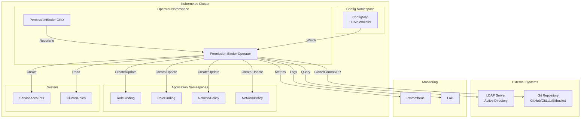

### Component Interaction

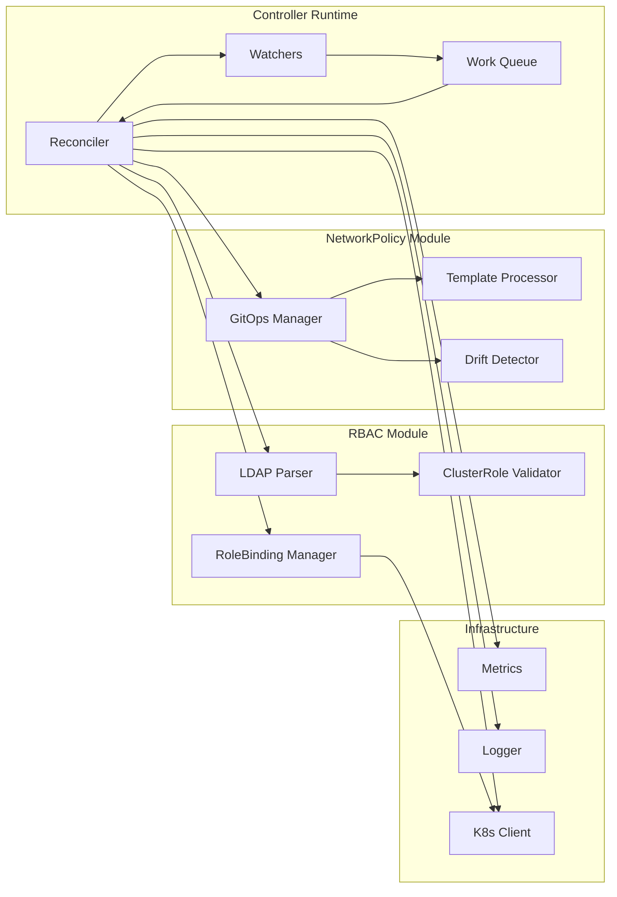

## Component Architecture

### PermissionBinderReconciler

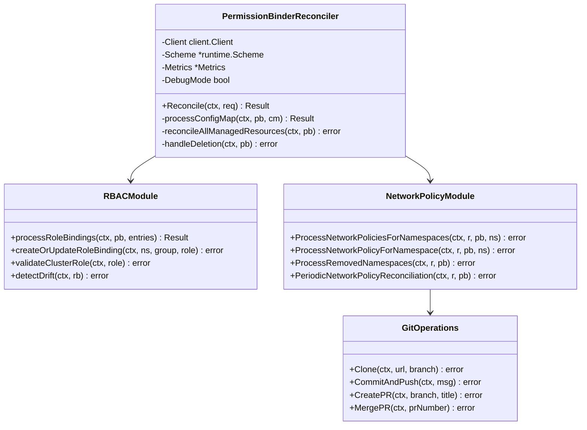

### NetworkPolicy Module Structure

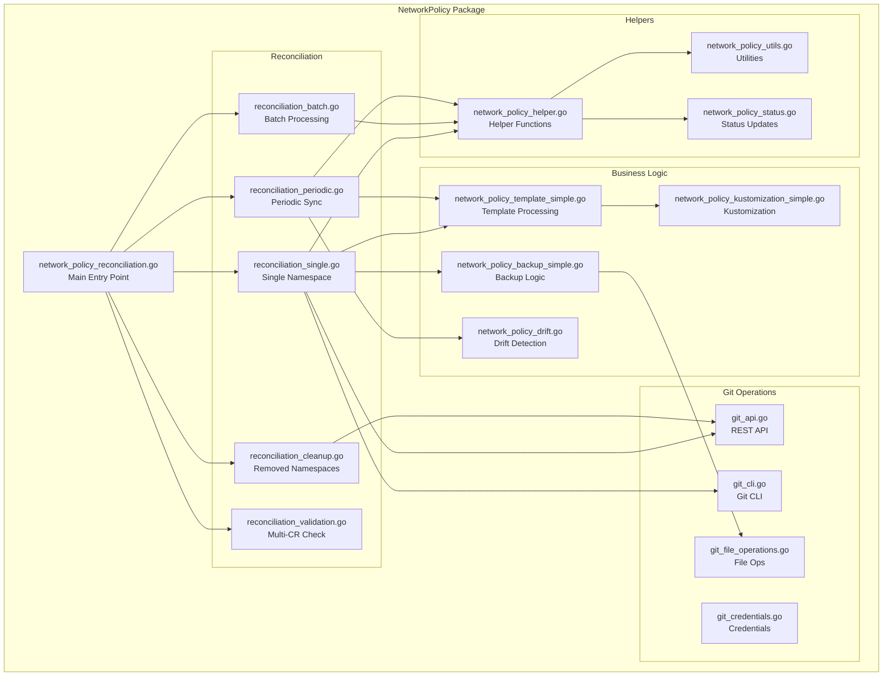

## Data Flow

### RBAC Reconciliation Flow

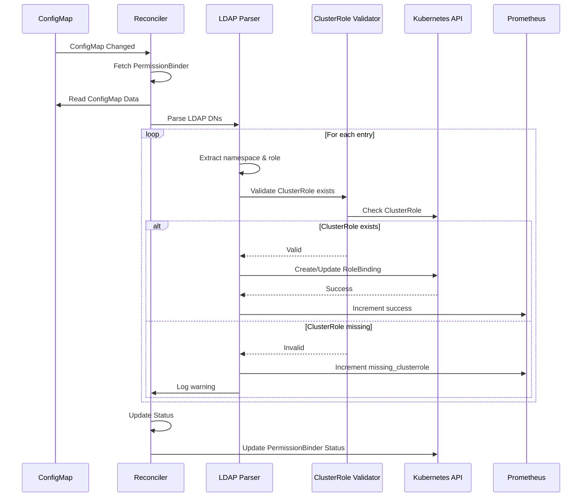

### NetworkPolicy GitOps Flow

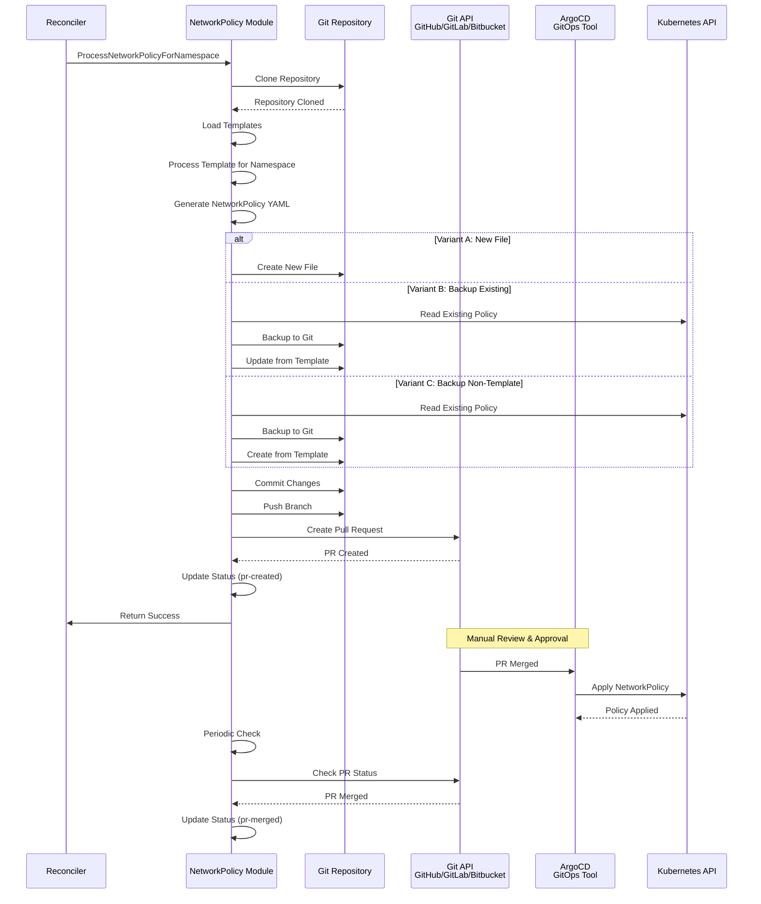

### Periodic Drift Detection Flow

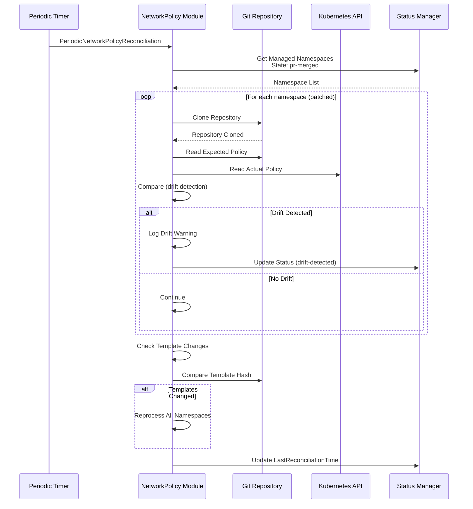

## Deployment Architecture

### Operator Deployment

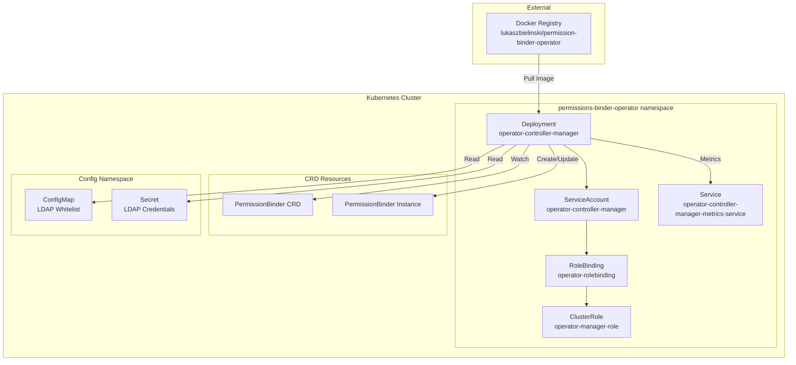

### Multi-Architecture Support

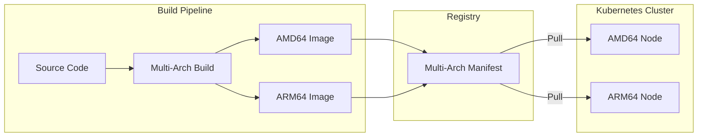

## Security Architecture

### Authentication & Authorization

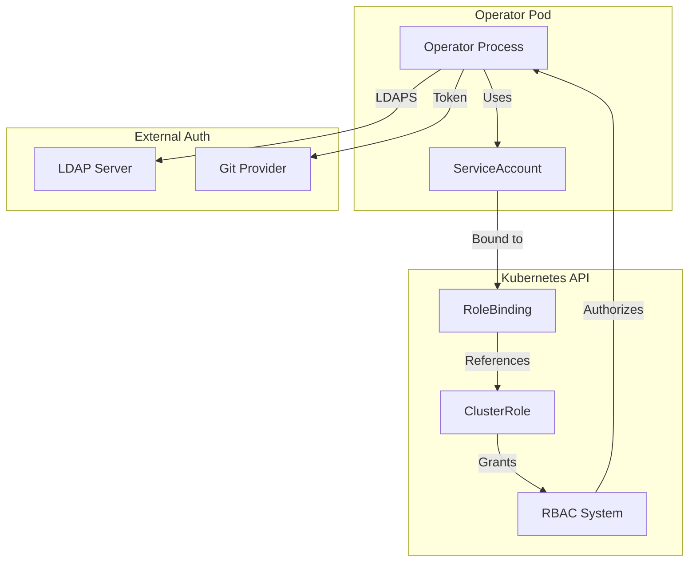

### Secret Management

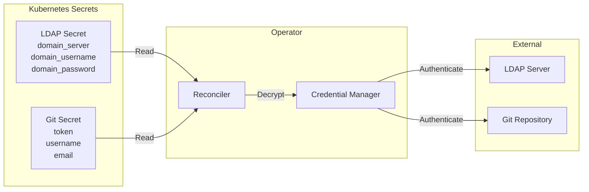

### Audit Trail

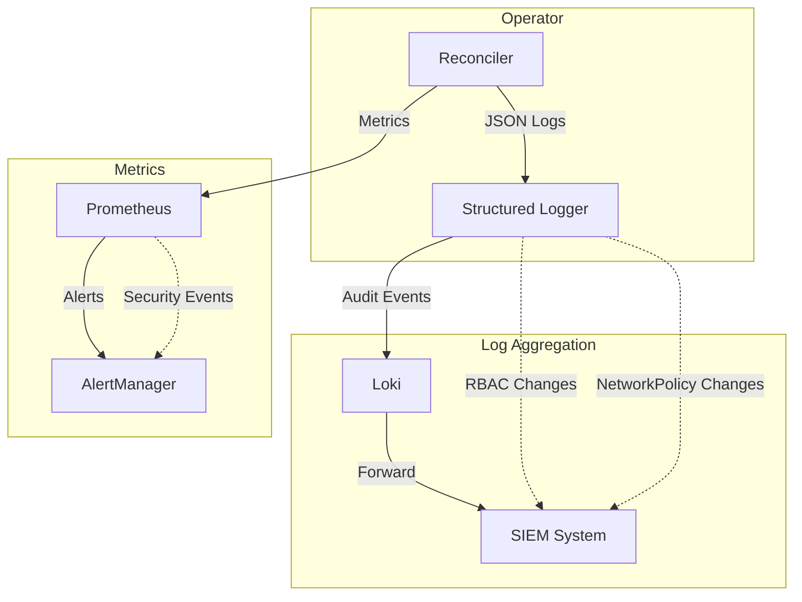

## Key Design Decisions

### 1. SAFE MODE (Orphaning vs Deletion)
- **Decision**: Resources are orphaned, never deleted
- **Rationale**: Zero data loss in production, automatic recovery
- **Implementation**: Annotations mark resources as orphaned

### 2. GitOps for NetworkPolicy
- **Decision**: NetworkPolicy changes via Pull Requests
- **Rationale**: Change control, approval workflow, audit trail
- **Implementation**: Operator creates PRs, manual merge triggers GitOps sync

### 3. Batch Processing
- **Decision**: Process namespaces in batches with delays
- **Rationale**: Rate limiting, GitOps sync time, etcd load
- **Implementation**: Configurable batch size and sleep intervals

### 4. Drift Detection
- **Decision**: Periodic reconciliation detects configuration drift
- **Rationale**: Detect manual changes, ensure compliance
- **Implementation**: Compare Git state vs cluster state

### 5. Multi-Architecture Support
- **Decision**: Support both AMD64 and ARM64
- **Rationale**: Edge computing, mixed clusters
- **Implementation**: Multi-arch Docker builds with manifest lists

---

**Last Updated**: 2025-01-15  
**Version**: v1.6.0-rc2

