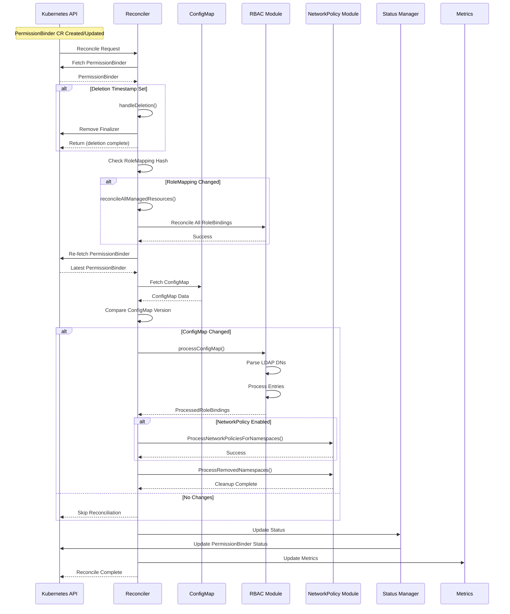
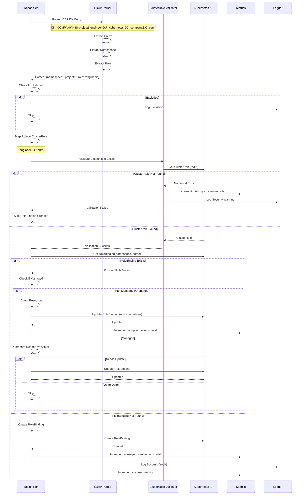
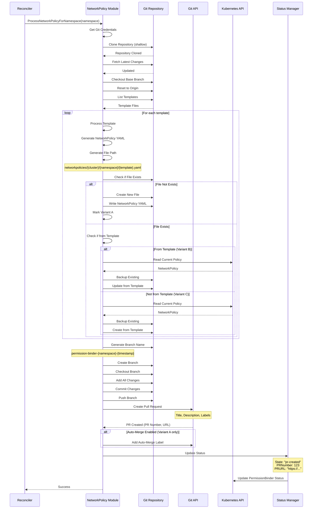
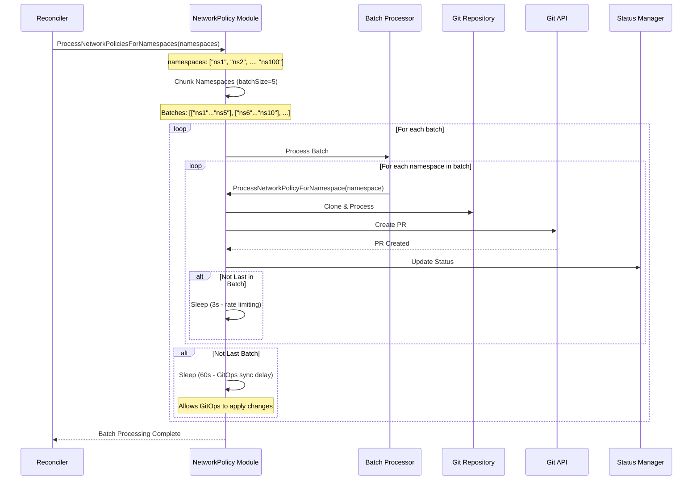
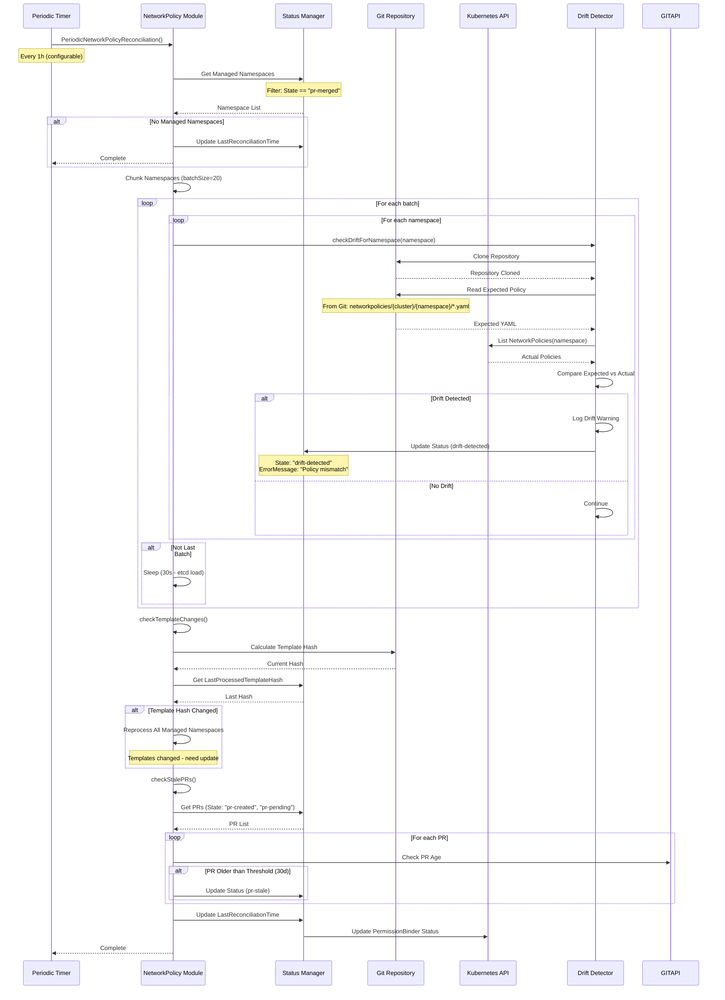
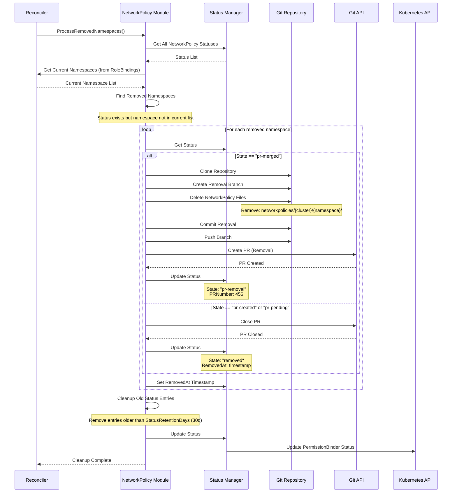
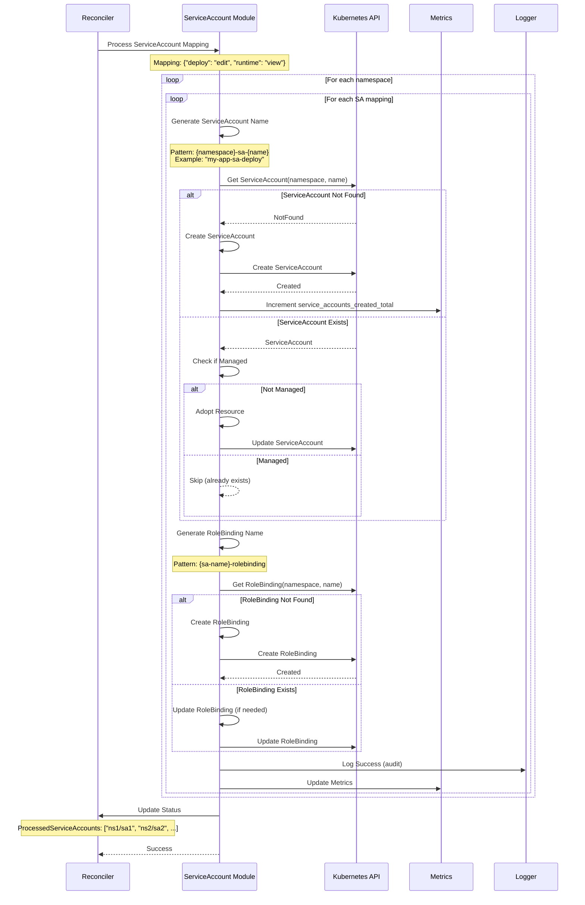
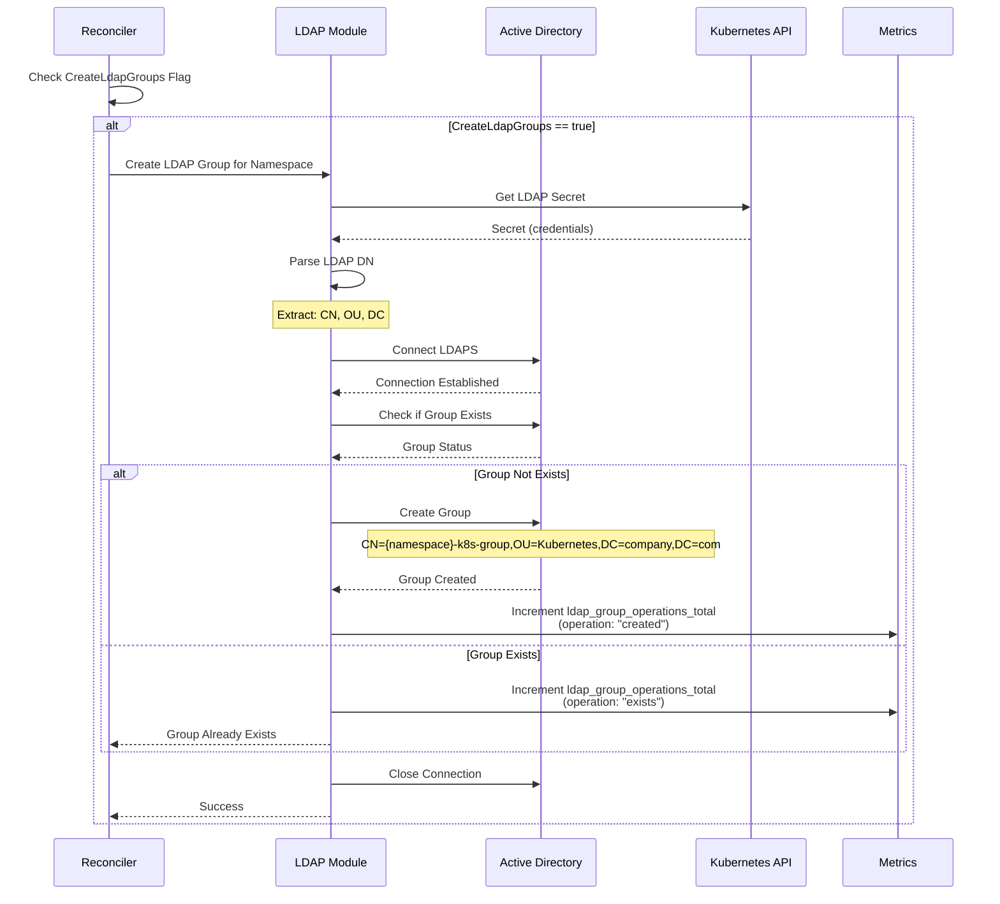
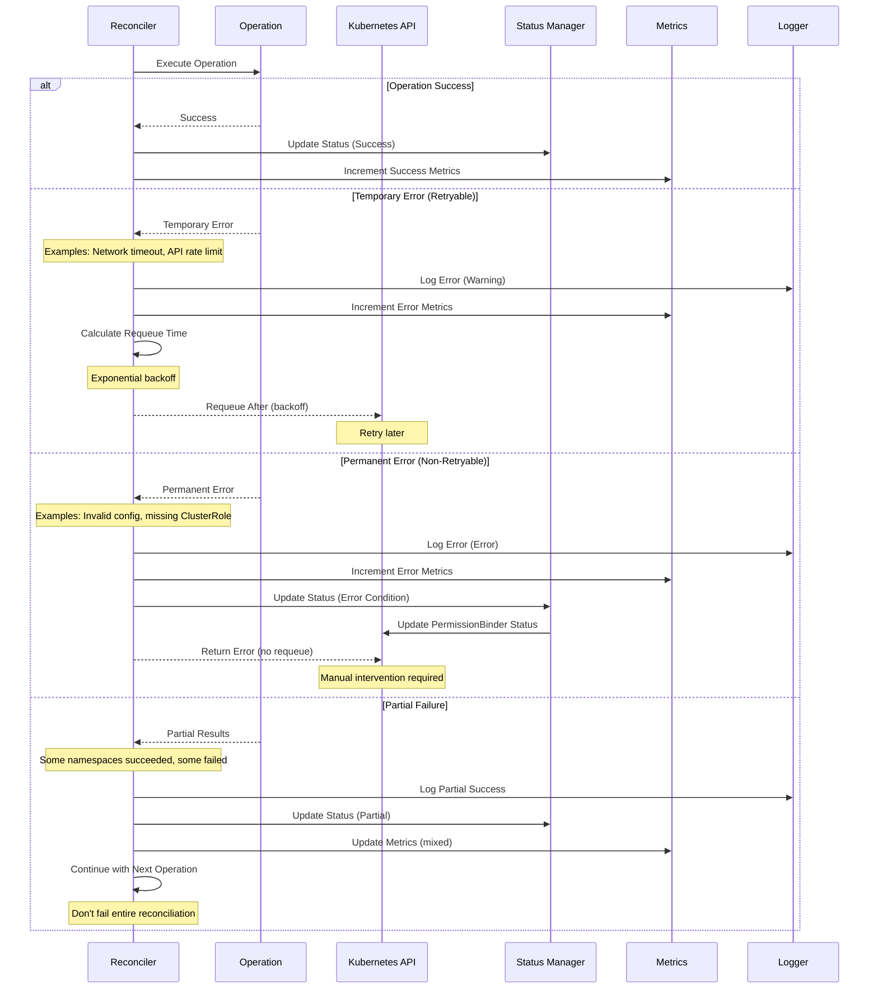
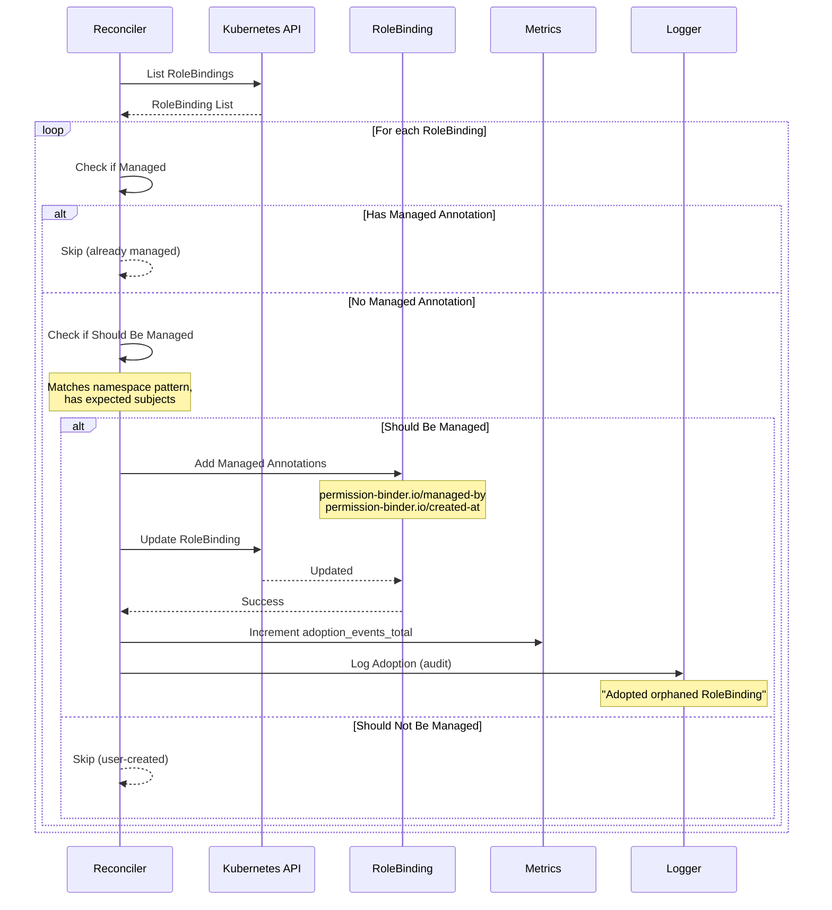

# Permission Binder Operator - Sequence Diagrams

## Table of Contents

1. [Main Reconciliation Flow](#main-reconciliation-flow)
2. [RBAC RoleBinding Creation](#rbac-rolebinding-creation)
3. [NetworkPolicy Single Namespace Processing](#networkpolicy-single-namespace-processing)
4. [NetworkPolicy Batch Processing](#networkpolicy-batch-processing)
5. [NetworkPolicy Drift Detection](#networkpolicy-drift-detection)
6. [NetworkPolicy Cleanup Flow](#networkpolicy-cleanup-flow)
7. [ServiceAccount Creation](#serviceaccount-creation)
8. [LDAP Group Creation](#ldap-group-creation)
9. [Error Handling & Recovery](#error-handling--recovery)

## Main Reconciliation Flow

### Complete Reconciliation Cycle

## RBAC RoleBinding Creation

### Single RoleBinding Creation Flow

## NetworkPolicy Single Namespace Processing

### Variant A: New File from Template

## NetworkPolicy Batch Processing

### Event-Driven Batch Reconciliation

## NetworkPolicy Drift Detection

### Periodic Drift Detection & Reconciliation

## NetworkPolicy Cleanup Flow

### Removed Namespace Cleanup

## ServiceAccount Creation

### ServiceAccount with RoleBinding Flow

## LDAP Group Creation

### Automatic LDAP Group Creation Flow

## Error Handling & Recovery

### Error Recovery & Retry Flow

### Orphaned Resource Adoption

---

**Last Updated**: 2025-11-14  
**Version**: v1.6.5

